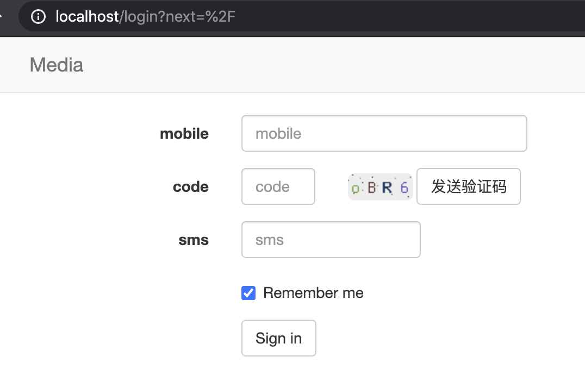
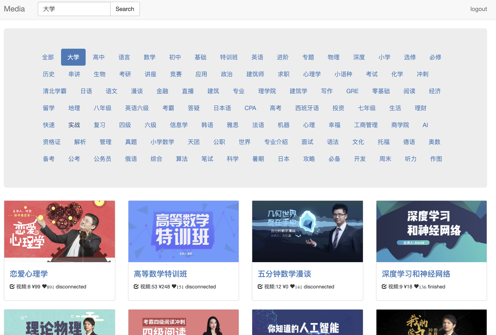
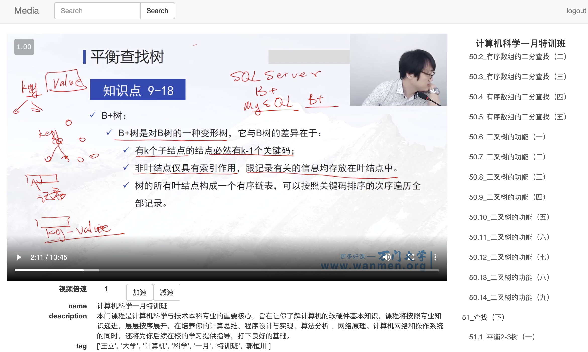

# name
wanmen 视频资源整合站

# description
nginx + flask + mongo

业务主要文件介绍
 ```c
├── app.py            #主文件，路由、业务逻辑实现
├── common.py         #公共方法
├── config.py         #参数配置
├── models.py         #数据库模型
├── search_page.py    #数据抓取脚本
├── sms.py            #短信验证逻辑，利用了逻辑bug。
 ```





所有资料均来自于互联网，仅供学习交流使用，侵删。

# using
1. 初始化环境
```c
docker-compose up -d
```

2. 运行 wanmen 数据抓取脚本
```c
docker exec -it wanmen_web_flask_1 /bin/sh
python3 search_page.py
```

3. 访问web，http://localhost
